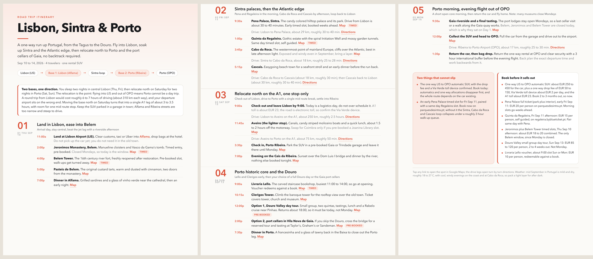

<div align="center">

# 🧭 trip-planner

### Plan a trip that survives contact with reality. Ship it as a PDF the whole group can tap.

Most trip plans break on the boring stuff. The Airbnb turns out to be 70 miles from the sights. The return flight sits on the single worst traffic day of the year. The 12-seat van has nowhere to put 12 people's bags. **trip-planner front-loads the parts that actually break a trip**, geography, dates, and logistics, red-teams the plan for those failure modes, verifies every place is open on your real dates, and ships a clean, shareable PDF where every stop is a tappable Google Maps link.

A skill for [Claude Code](https://docs.claude.com/en/docs/claude-code).

[](LICENSE)
[](https://docs.claude.com/en/docs/claude-code)
[](#what-it-does-the-method)


<br>
<sub><i>One prompt in. A day-by-day itinerary that holds up, shipped as a PDF the group navigates from their phones.</i></sub>

</div>

---

## Install

```bash
git clone https://github.com/thisizmsk-png/trip-planner.git ~/.claude/skills/trip-planner
```

Then in a Claude Code session, just describe the trip, or call it directly:

```
/trip-planner fly into LAX Jul 1, 7 of us, base near Santa Monica, do the coast and Vegas, fly out of LAS Jul 5
```

It asks for the few constraints that matter, plans it, red-teams it, checks the dates, and hands you a PDF.

---

## See it in action

The full run, constraints to red-team to a finished PDF with tappable map links:

▶︎ [docs/assets/trip-planner-explainer.mp4](docs/assets/trip-planner-explainer.mp4)

> The GIF above embeds inline anywhere. To embed the MP4 as an auto-playing player, drag it into the GitHub README editor.

---

## What it does (the method)

It runs six phases in order, and it does not skip the unglamorous ones:

1. **Pin the hard constraints.** Dates to days-of-week, party size and vehicle, flights in and out with times, and the *exact* lodging spot (the hidden variable that dictates every drive).
2. **Geography first.** Locate the base, compute drive times to every cluster, and surface immediately if the base is far from the sights. Order each day to flow one direction so there are no silent backtracks.
3. **Red-team the plan.** An adversarial pass returns P0 (trip-breaking) / P1 (serious) / P2 (annoyance) with concrete fixes. Worst-traffic holiday days, perishable bookings, vehicle-vs-luggage, late-night-vs-early-departure, single-vehicle desert breakdowns.
4. **Verify open on the real dates.** Web-search every timed or operator-run place for day-of-week closures, seasonal maintenance, holiday hours, and summer heat windows. Cite the sources.
5. **Build the deliverable.** A one to three page PDF, designed (HTML to headless Chrome) for real typography and clickable links, with a reportlab fallback. Every stop is a Google Maps link; every long drive is a directions link.
6. **Iterate.** Party size changes, days get swapped, colors get tweaked. One source of truth per variant, re-rendered together so they never drift.

See [`SKILL.md`](SKILL.md) for the full playbook, the recurring failure modes, and the PDF design spec.

---

## Why it is different

- **It plans on geography, not on the fun list.** The base location reshapes the whole trip, and this surfaces that on the first pass instead of on day two.
- **It is red-teamed before you ever see it.** The plan gets attacked for the failure modes that actually strand groups, with fixes, not a cheerful list of sights.
- **It checks the calendar for your real dates.** Closures, holiday traffic, and desert heat are verified against the specific days you travel, with source links.
- **The output is genuinely shareable.** A clean PDF, one locked accent, big day numerals, a route strip, must-do and book-now alert cards, and tappable map links the whole group uses from their phones.

---

## What you get out

A PDF that looks designed, not generated: light paper, near-black ink, one accent color, a tabular time rail per day, a base-note callout, and two alert cards (a filled "can-not-slip" card and an outlined "book-now" card). Coral and an emerald-and-gold variant ship out of the box; ask for more.

See a real one: [examples/lisbon-sintra-porto.pdf](examples/lisbon-sintra-porto.pdf), a 5-day Lisbon to Porto trip generated end to end by this skill (geography-first relocation, a red-team in the alert cards, hours checked for the real dates, and 25 tappable map links).



---

## License

MIT. See [LICENSE](LICENSE). Use it, fork it, plan good trips.
